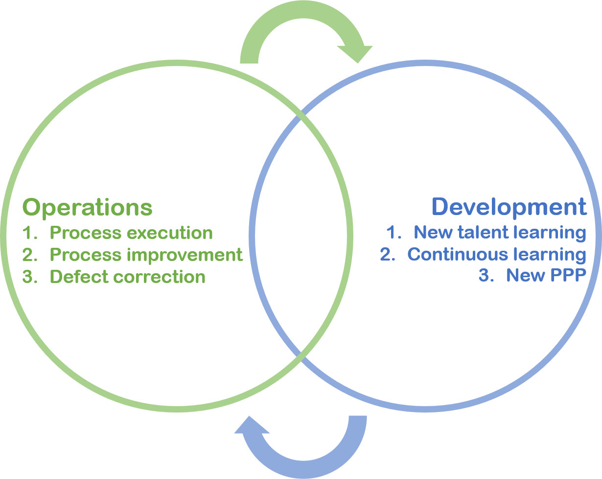

# How will this work?
General explanation of the learninign strategy

<iframe width="560" height="315" src="https://www.youtube.com/embed/L_jWHffIx5E?rel=0" frameborder="0" allow="autoplay; encrypted-media" allowfullscreen></iframe>

##	How are going to learn?
a.	Diffused vs focused and why this is important
    i.	Here we explain the structure of the learning program, what they’ll find and how to better they are learning.     When they need to pay extra attention to detail because specifics are being covered and when it is about concepts     and ideas and a more relaxed state of mine will do.
    
<iframe src="https://www.google.com/maps/d/u/0/embed?mid=1tlsmmZ67cllYartyovP_KBrTG8cjc3In" width="780" height="600"></iframe>
    
## Premier general services and industry introduction
a.	Diffused thinking: All of these topics are covered in a light not demanding way. We a
  i.	Who we are and what we do
  ii.	What’s the deal with all those DSP, RMC, etc.?
  iii.	Mission & vision
  iv.	Ethics & values
  v.	Premier’s structure
b.	Premier Team & Structure
  
  
## Premier’s goals: Premier experience
  What is The Premier’s Experience and Philosophy 
  
<iframe src="https://docs.google.com/presentation/d/e/2PACX-1vTeN1HncpGB8acbSsT97THxjpuagWmAeBfY_a8UTc686GKAoPa8XV4ZhwuVRwtOZ1B7mTWRFCHZgEzY/embed?start=false&loop=false&delayms=3000" frameborder="0" width="780" height="600" allowfullscreen="true" mozallowfullscreen="true" webkitallowfullscreen="true"></iframe>

## Go to your first test
<iframe src="https://docs.google.com/forms/d/e/1FAIpQLScz77JMfwnqb9a6x5XDSL0pY2BNUqLMCHznhkR3nrZLYeU63A/viewform?embedded=true" width="700" height="520" frameborder="0" marginheight="0" marginwidth="0">Loading...</iframe>
Opera

What is opera here?
